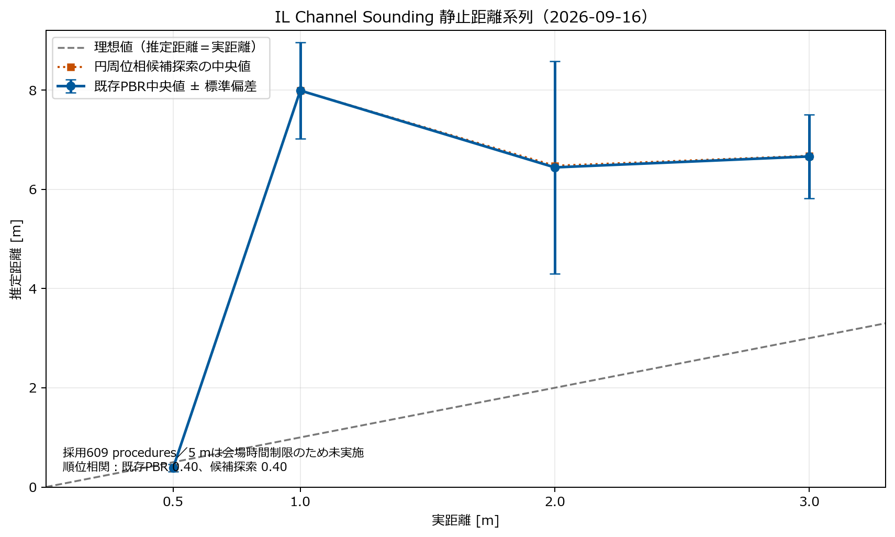

# IL-Phase 0 2026-09-16 見通し静止距離評価

## 1. 目的

モバイルバッテリー給電のTAG / ReflectorとPC接続のLOCATOR / Initiatorを、磁性体の影響を避けた見通し環境へ配置し、0.5 / 1.0 / 2.0 / 3.0 mにおけるChannel Sounding（CS）の通信成立、rawデータ完全性、距離順序、絶対距離傾向を確認した。

本評価はNCS v3.2.3のconnected Channel Soundingサンプルに含まれる基本推定器を基準とする。Bluetooth Channel Soundingは測距に必要な位相・時刻情報を提供するが、距離推定アルゴリズム自体を規定しない。したがって、基本推定器の値をそのまま製品距離精度とは扱わない。

## 2. 測定条件

- LOCATOR / Initiator: nRF54L15 DK、PC給電、UARTログ取得
- TAG / Reflector: nRF54L15 DK、モバイルバッテリー給電
- 配置: 磁力のない机、見通し、同じ高さ・向き
- 実距離: 0.5 / 1.0 / 2.0 / 3.0 m
- 反復: 各距離60秒×3試行
- 評価区間: 各試行の先頭10 proceduresを除外
- 5.0 m: 場所の時間制限により今回は未実施

## 3. 採用・除外データ

| 実距離 | 採用ログ時刻 | 採用解析ディレクトリ | 備考 |
|---:|---|---|---|
| 0.5 m | 09:14:21 / 09:15:40 / 09:16:52 | `20260916_open_space_0p5m/trial1`～`trial3` | 3試行採用 |
| 1.0 m | 09:24:33 / 09:26:04 / 09:27:16 | `20260916_open_space_1p0m/trial1`～`trial3` | 3試行採用 |
| 2.0 m | 09:34:54 / 09:37:23 / 09:38:37 | `20260916_open_space_2p0m/trial3`～`trial5` | trial1、trial2はUART破損のため除外 |
| 3.0 m | 09:42:38 / 09:45:06 / 09:47:28 | `20260916_open_space_3p0m/trial1`、`trial3`、`trial4` | trial2はUART破損のため除外。trial1末尾のcapture終了境界は評価へ影響なし |

2.0 mの初回2試行と3.0 mのtrial2では、checksum不一致、record sequence gap、行の結合・欠落を確認した。距離推定の良否とUART転送破損を混同しないため、これらは保存したまま距離評価から除外した。

## 4. 結果

| 実距離 | 有効procedures | 基本PBR中央値 | 基本PBR標準偏差 | 位相残差中央値 | 円周位相探索中央値 |
|---:|---:|---:|---:|---:|---:|
| 0.5 m | 153 | 0.383 m | 0.072 m | 0.165 rad | 0.380 m |
| 1.0 m | 152 | 7.991 m | 0.967 m | 0.260 rad | 7.990 m |
| 2.0 m | 150 | 6.441 m | 2.141 m | 0.854 rad | 6.475 m |
| 3.0 m | 154 | 6.662 m | 0.845 m | 0.412 rad | 6.675 m |

- 有効PBR: 609 / 612 procedures（99.5%）
- firmware error: 0件
- 基本PBR中央値と実距離のSpearman順位相関: 0.40
- 円周位相探索中央値と実距離のSpearman順位相関: 0.40
- Phase 0基準: 0.90以上

0.5 mは実距離に近い値だったが、1.0 mで約8 mへ跳び、2.0 / 3.0 mも約6.4～6.7 mとなった。0.5 / 1.0 / 2.0 / 3.0 mの距離順序は成立せず、部分系列でもPhase 0の距離順位基準を満たさない。

参考としてRTT中央値は0.5 / 1.0 / 2.0 / 3.0 mの順に3.897 / 11.837 / 11.750 / 10.134 mで、こちらも単調ではなかった。local / peer RSSI中央値も単調変化せず、今回の配置だけから距離代替指標にはできない。

## 5. オフライン推定器比較

既存の`il_cs_raw_analyze.py`について、NCS v3.2.3の`distance_estimation.c`と次を照合した。

- local / peer IQの複素積
- 周波数順のsort
- 1次元phase unwrap
- 線形回帰
- 傾きから距離への換算式

照合結果は一致し、ILGA側の符号・単位・複素演算の実装ミスは確認されなかった。

さらに、逐次unwrapを使用せず0～10 mを0.01 m刻みで直接探索する円周位相fitを別ツールで評価した。中央値は基本PBRとほぼ同じで、順位相関も0.40のままだった。外れchannelを20%除く試行と、0.5 mの1試行から求めたchannel別位相補正も1～3 mへ一般化しなかった。

以上から、今回の不成立は単純なunwrap方法や固定offsetだけでは説明できない。配置・アンテナ・マルチパスと、基本推定器が持つ距離多値性やロバスト性不足を含めて再検討する必要がある。

## 6. 判定

| 項目 | 判定 | 根拠 |
|---|---|---|
| BLE / CS送受信 | 合格 | 4距離、採用12試行で継続取得 |
| channel-level raw取得・解析 | 合格 | 採用データ609 proceduresを解析可能 |
| 採用試行のデータ完全性 | 条件付き合格 | 609 / 612有効、firmware error 0。ただし別試行でUART破損あり |
| 0.5～3.0 m距離順序 | 不合格 | Spearman 0.40、1 mで大きく逆転 |
| 絶対距離精度 | 不合格 | 1～3 mで数mの誤差 |
| 固定補正の一般化 | 不成立 | channel補正・円周位相探索で改善せず |
| ゾーン判定への移行 | 保留 | 現値を距離閾値へ直接使用できない |

CS通信およびraw観測経路は成立している。一方、現サンプル推定器と今回の設置条件の組み合わせでは、距離尺度としての成立は確認できない。従って、同じ条件の静止距離測定を増やすより、推定器・測定条件を改善してから再評価する。

## 7. 次の方針

1. 現行解析器を変更せず、`il_cs_series_evaluate.py`を比較専用経路として維持する。
2. UART破損はRF距離評価と分離し、6 / 8 / 10 ms pacing等の短いsmoke matrixで再現性を確認する。
3. 距離推定は複数候補、channel品質、残差、RTT併用を含む方式を調査し、保存rawへオフライン適用する。
4. 改善候補が得られた後に、距離順をランダム化し、再設置反復、向き変更、5 mを含む見通し静止試験を行う。
5. 静止距離順位が成立するまで、境界・接近離脱・ゾーン判定の本実装へ進まない。

## 8. 成果物

- `distance_summary.csv`: 距離別集計
- `metrics.json`: procedures数と順位相関
- `il_phase0_20260916_distance_series.png`: 真値と2推定方式の比較図
- `analysis_out/il_cs_raw/20260916_open_space_series_evaluation/`: procedure別の詳細結果

## 9. 参考

- Bluetooth SIG, Channel Sounding: <https://www.bluetooth.com/learn-about-bluetooth/feature-enhancements/channel-sounding/>
- Zephyr Project, Channel Sounding initiator with ranging requestor sample: <https://docs.zephyrproject.org/latest/samples/bluetooth/channel_sounding/README.html>
- Bluetooth Core Specification, Channel Sounding: <https://www.bluetooth.com/wp-content/uploads/Files/Specification/HTML/Core_v6.3/out/en/low-energy-controller/channel-sounding.html>
